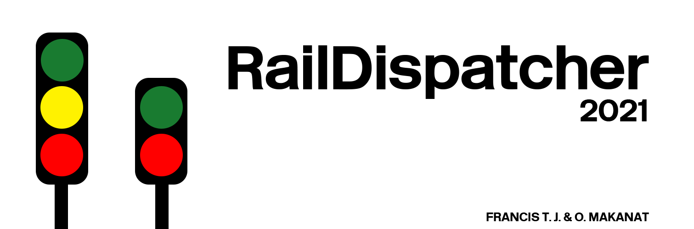

# RailDispatcher
Train signalling simulation for Thai and its environment modern railway signalling system.

# Installation
This app will only work if you have these following programs:
* Electron (LEARN MORE: https://www.electronjs.org/docs/tutorial/quick-start)
* Node.js

# Contribution
* <b>T. Koonruttanasiri</b> - Provide map and measured layout of <i>Nakhon Pathom</i> and its surrounded stations
* <b>J. Anekpong</b> - Provide and create map and measured layout of <i>Bang Sue Grand Station</i> and its surrounded stations

# License
MIT License
Copyright (c) 2021 Francis T. Jalikula & O. Makanat

